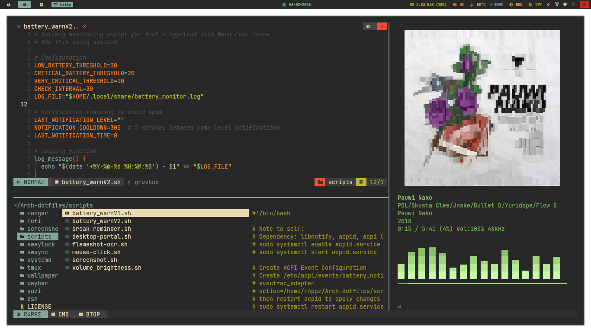
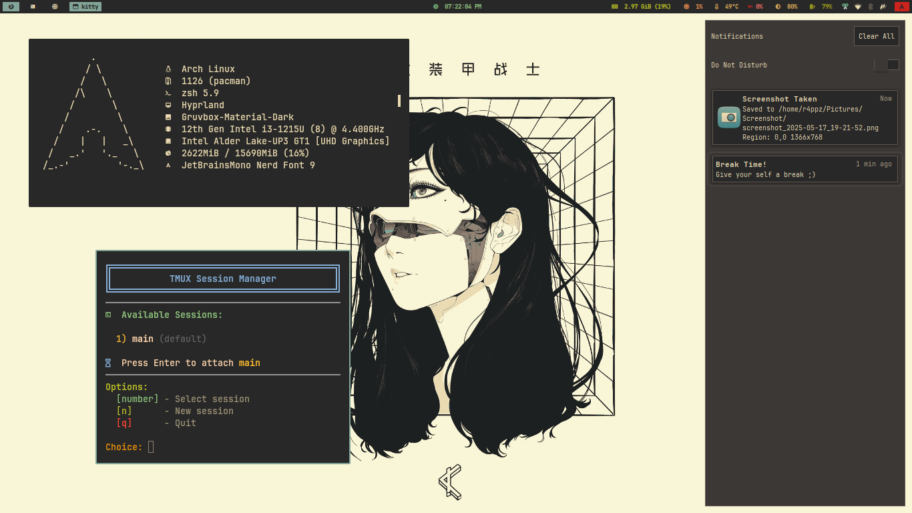
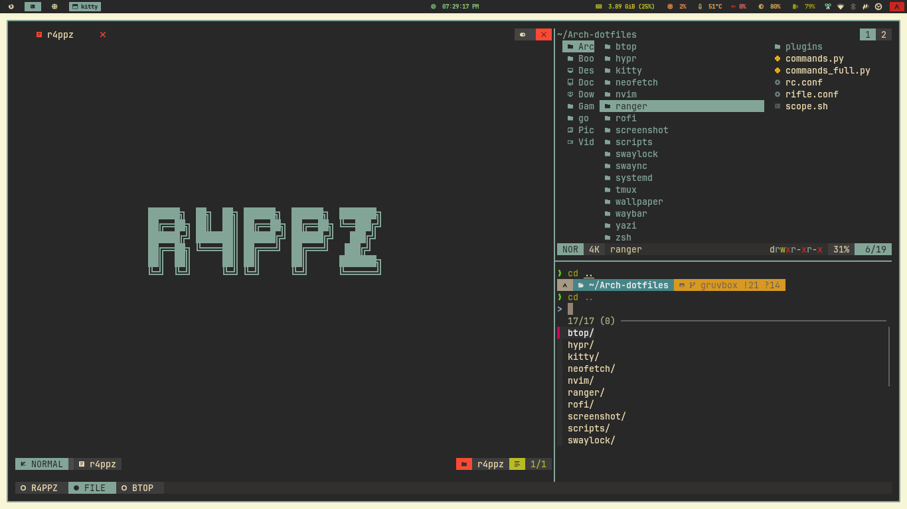
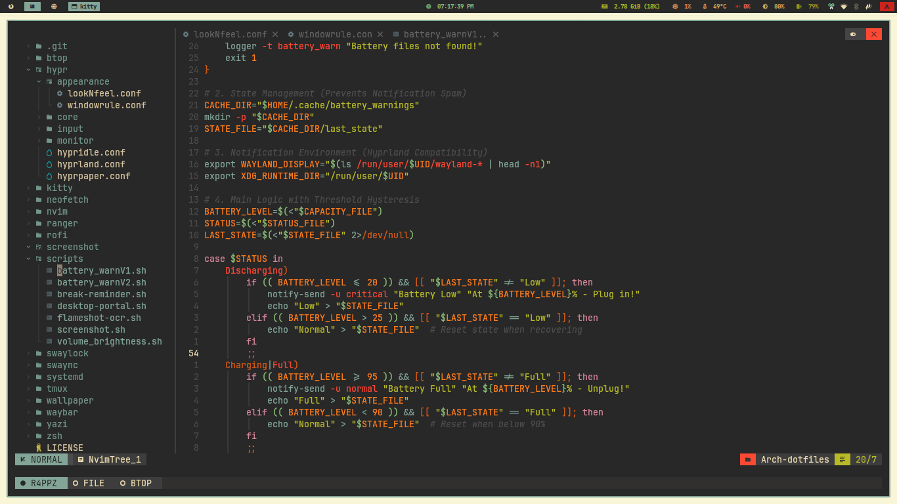
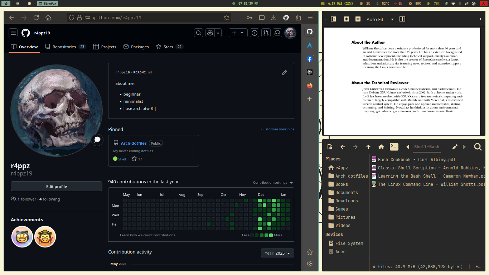
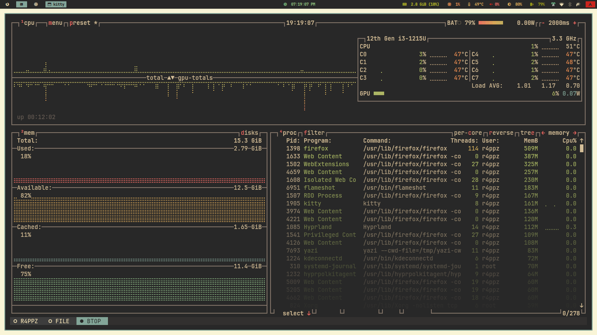

## My personal dotfiles for Arch Linux + Hyprland.

**Ricing is personal art.**

This is my setup's **backup** in case I mess something up, a living **reference** of how I've configured things, and a place to keep track of stuff I've **learned** using Linux.

These files fit *my* workflow and *my* taste. Look through, take ideas, build your own setup ;).

## Setup

* **OS:** Arch Linux
* **WM:** Hyprland
* **Terminal:** Kitty
* **Shell:** Zsh + Antidote ([Plugins](zsh/zsh_plugins.txt))
* **Font:** JetBrainsMono Nerd Font
* **Theme:** Gruvbox
    * GTK: [Gruvbox-Material-Dark](https://github.com/TheGreatMcPain/gruvbox-material-gtk)
    * QT: [Gruvbox-Dark-Blue](https://github.com/sachnr/gruvbox-kvantum-themes)
    * Icons: [Gruvbox Plus Dark](https://github.com/SylEleuth/gruvbox-plus-icon-pack)
* **Cursor:** [Hackeyed](https://www.gnome-look.org/p/999998)
* **Display Manager:** SDDM ([config from](https://github.com/Keyitdev/sddm-astronaut-theme))
* **Notification:** SwayNC 
* **Bar:** Waybar 
* **Launcher:** Rofi ([config from](https://github.com/adi1090x/rofi))
* **File Managers:** Thunar (GUI), Ranger, Yazi (TUI)
* **Wallpaper:** [here](https://wallhaven.cc/w/vq1z55)

## Screenshots

Click to expand screenshots

