## My personal dotfiles for Arch Linux + Hyprland.

**Ricing is personal art.**

This is my setup's **backup** in case I mess something up, a living **reference** of how I've configured things, and a place to keep track of stuff I've **learned** using Linux.

These files fit *my* workflow and *my* taste. Look through, take ideas, build your own setup ;).

## Setup

* **OS:** Arch Linux
* **WM:** Hyprland
* **Terminal:** Kitty
* **Shell:** Zsh + Antidote ([Plugins](zsh/zsh_plugins.txt))
* **Font:** JetBrainsMono Nerd Font
* **Theme:** Gruvbox
    * GTK: [Gruvbox-Material-Dark](https://github.com/TheGreatMcPain/gruvbox-material-gtk)
    * QT: [Gruvbox-Dark-Blue](https://github.com/sachnr/gruvbox-kvantum-themes)
    * Icons: [Gruvbox Plus Dark](https://github.com/SylEleuth/gruvbox-plus-icon-pack)
* **Cursor:** [Hackeyed](https://www.gnome-look.org/p/999998)
* **Display Manager:** SDDM ([config from](https://github.com/Keyitdev/sddm-astronaut-theme))
* **Notification:** SwayNC 
* **Bar:** Waybar 
* **Launcher:** Rofi ([config from](https://github.com/adi1090x/rofi))
* **File Managers:** Thunar (GUI), Ranger (TUI)
* **Wallpaper:** [here](https://wallhaven.cc/w/vq1z55)

## Screenshots

A look at different parts of the setup.

---

**Desktop Overview:** Hyprland layout with Waybar. Shows the general look and feel.
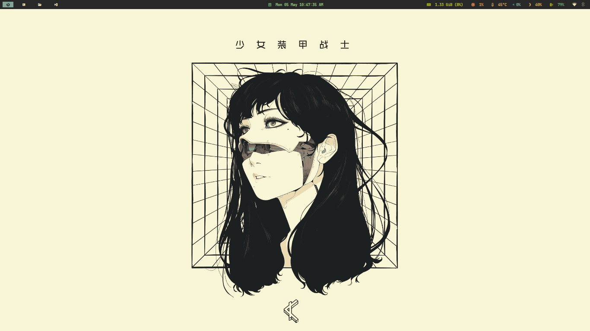

---

**System Info & Notifications:** Displaying neofetch and the notification daemon (swaync).
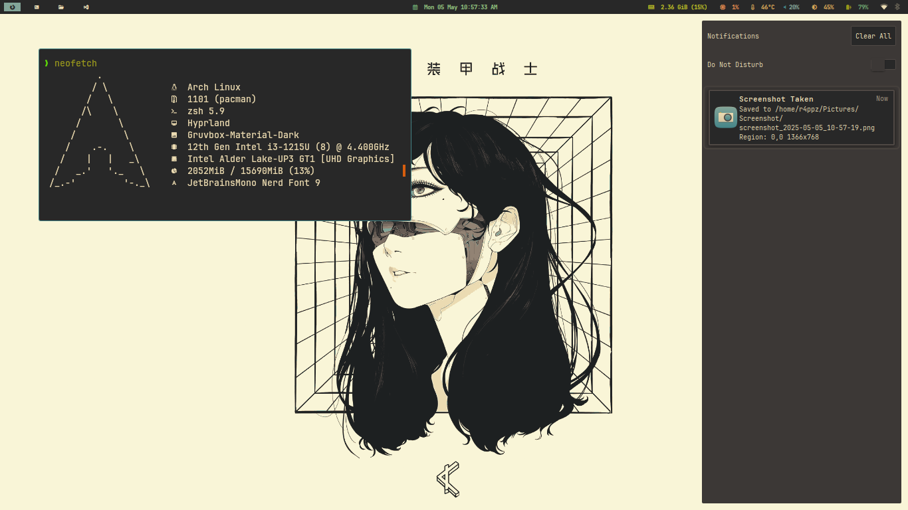

---

**Terminal Aesthetics:** btop, neofetch, and cava (audio visualizer) running in the terminal.
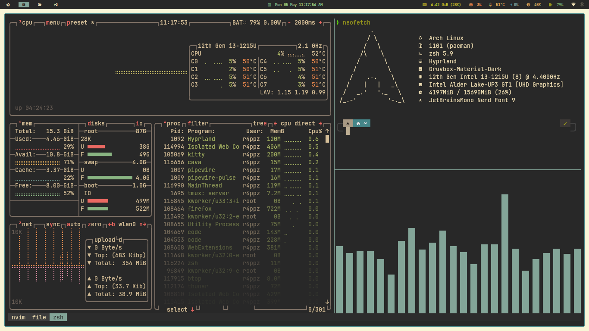

---

**Terminal & File Manager:** kitty terminal with tmux pane splitting. Showing Ranger file manager, Zsh completion, and terminal color scheme.
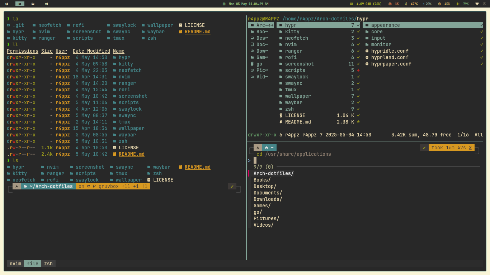

---

**Neovim:** Text editor with the color scheme applied.
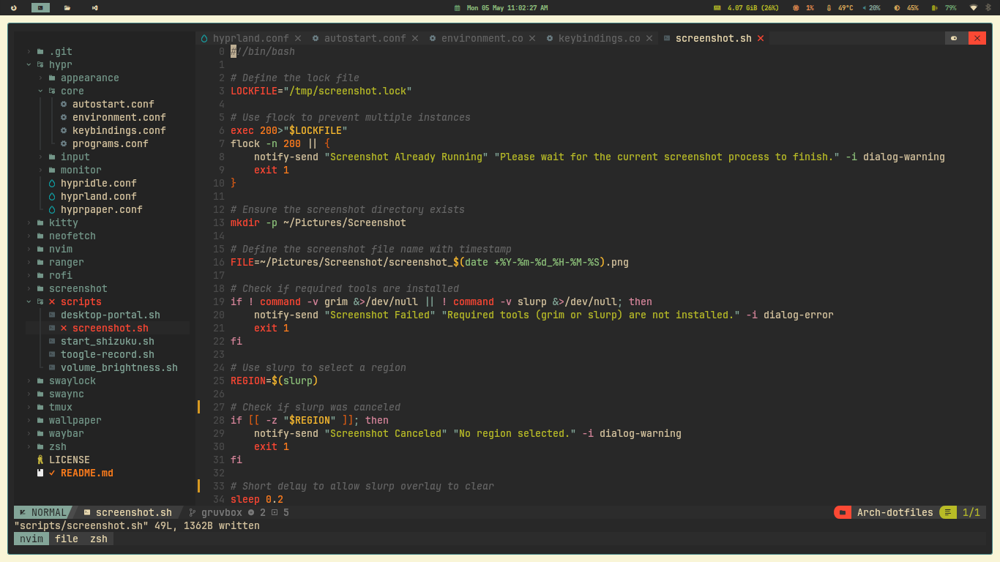

---

**Application Launcher (Rofi):** Rofi menu for launching applications.
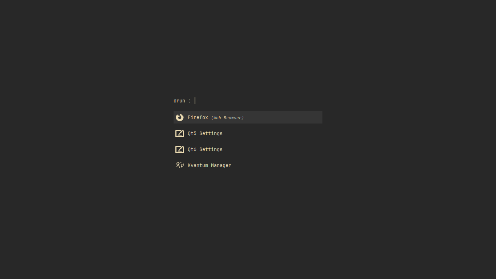

---

**Power Menu (Rofi):** Rofi menu for power/session management options.
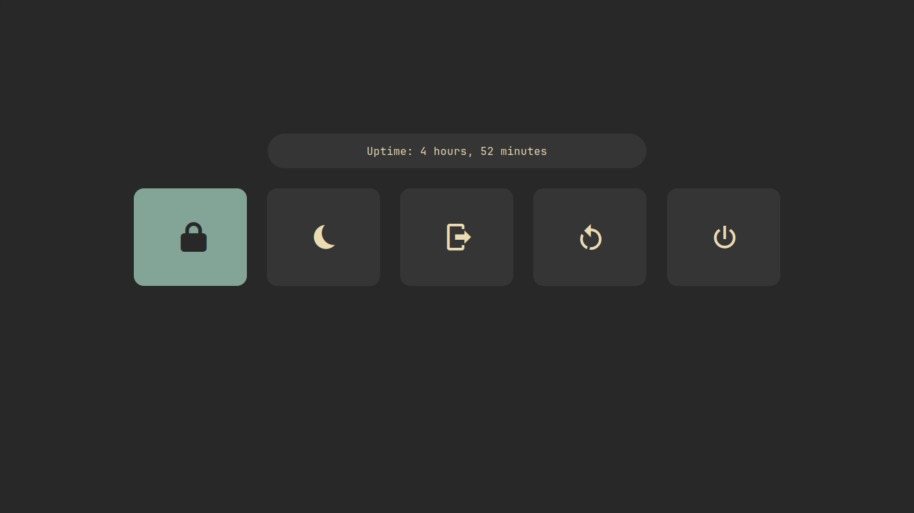

---

**VS Code:** Example of a GTK application themed.
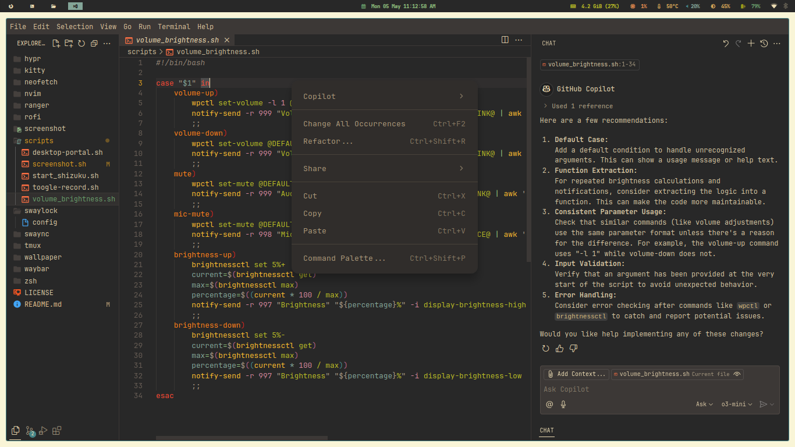

---

**Browser (Firefox):** Showing the GTK theme applied to the web browser.
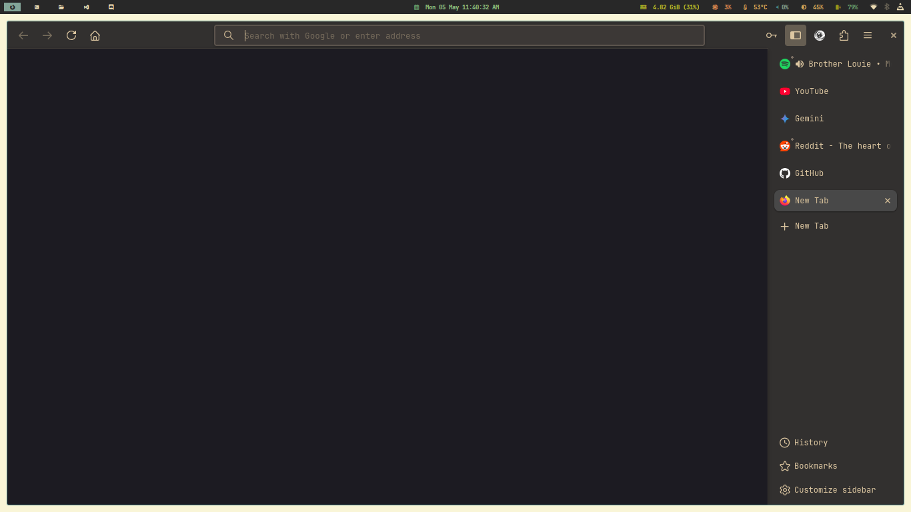

---

**File Manager (Thunar):** A graphical file manager showing GTK theme and icons.
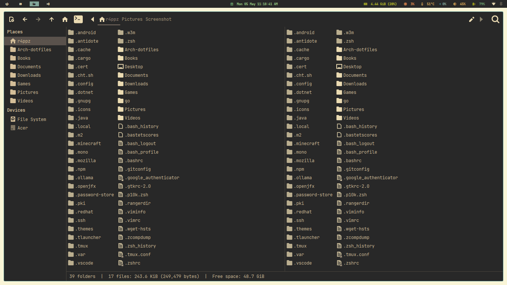

---

**QT Applications:** Examples like KeepassXC, VLC, and Okular showing the QT theme integration.
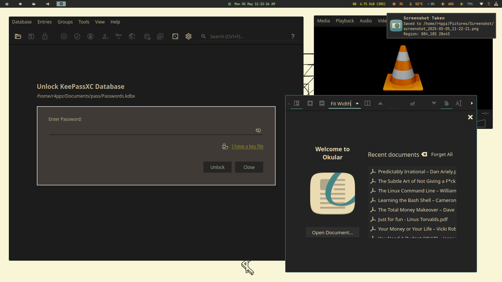

---