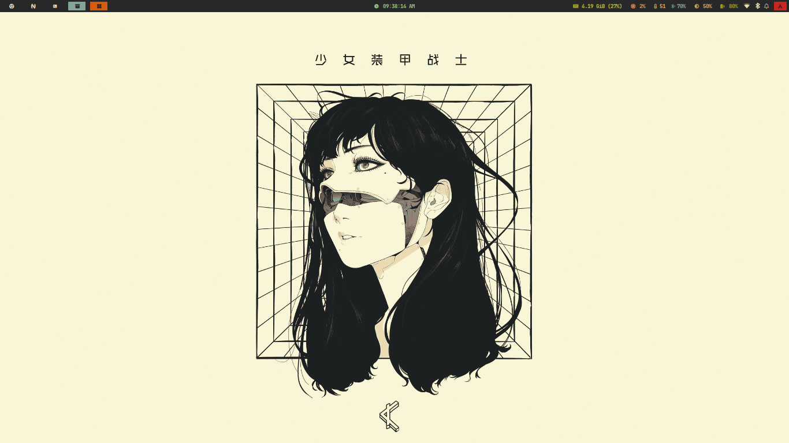
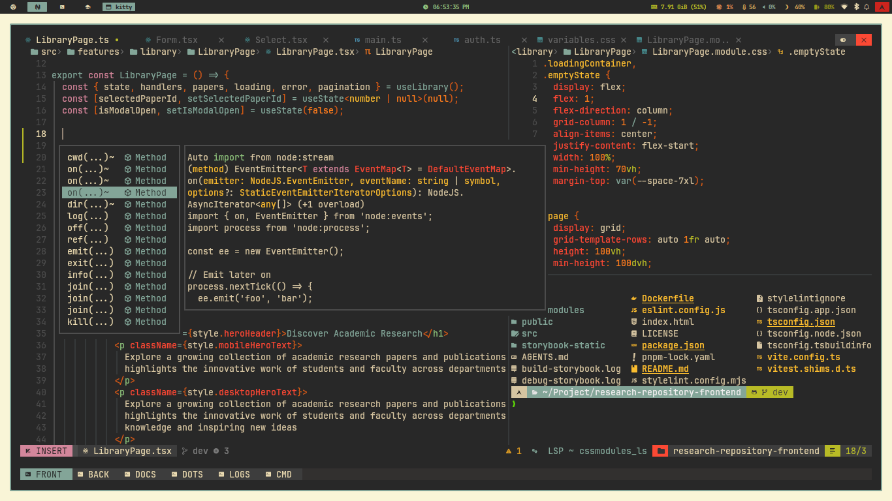
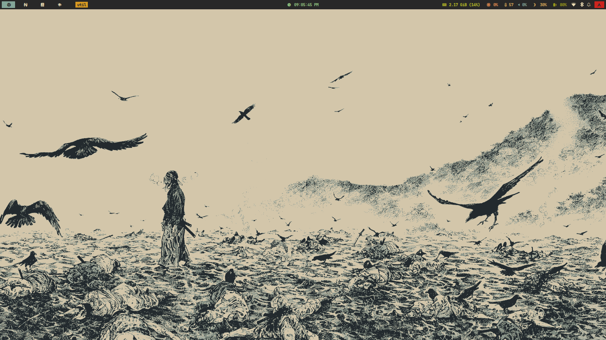
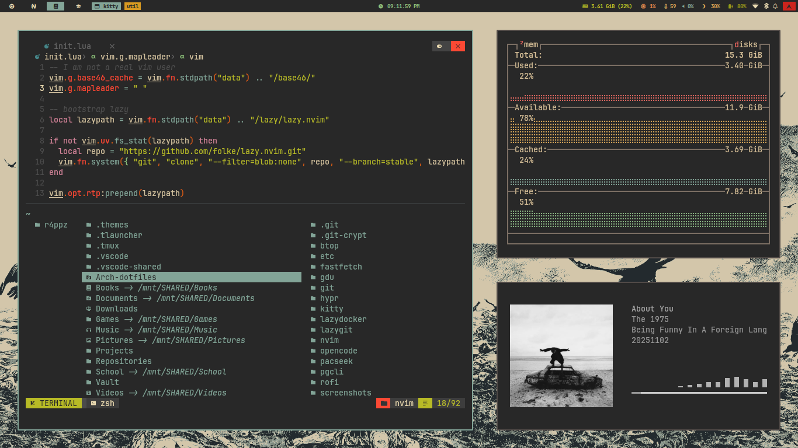
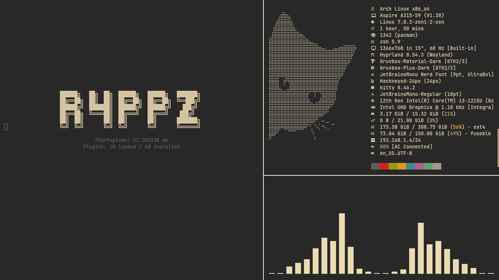

# Dot(.)files

> Configs I can't live without.

This repository contains all my configurations. It’s meant as a reference for how I set up my environment.

These files reflect my workflow and personal taste. Browse through, grab ideas, and build your own setup ;)

## Setup

- **OS:** [Arch Linux](https://archlinux.org/)
- **WM:** [Hyprland](https://hyprland.org/)
- **Terminal:** [Kitty](https://github.com/kovidgoyal/kitty)
- **Shell:** [Zsh](https://github.com/zsh-users/zsh) + [Antidote](https://antidote.sh/) ([Plugins](zsh/.zsh_plugins.txt))
- **Font:** [JetBrainsMono](https://www.jetbrains.com/lp/mono/)
- **Theme:** [Gruvbox](https://github.com/morhetz/gruvbox)
  - **GTK:** [gruvbox-material-gtk](https://github.com/TheGreatMcPain/gruvbox-material-gtk)
  - **QT:** [gruvbox-kvantum-themes](https://github.com/sachnr/gruvbox-kvantum-themes)
  - **Icon:** [gruvbox-plus-icon-pack](https://github.com/SylEleuth/gruvbox-plus-icon-pack)
- **Cursor:** [Hackeyed](https://www.gnome-look.org/p/999998)
- **Notification:** [SwayNC](https://github.com/ErikReider/SwayNotificationCenter)
- **Bar:** [Waybar](https://github.com/Alexays/Waybar)
- **Lock:** [Hyprlock](https://github.com/hyprwm/hyprlock/)
- **Launcher:** [Rofi](https://github.com/davatorium/rofi)
- **Music Player:** [Kew](https://github.com/ravachol/kew)/[Cliamp](https://github.com/bjarneo/cliamp)
- **File Managers:** [Thunar](https://github.com/xfce-mirror/thunar) (GUI), [Yazi](https://yazi-rs.github.io/) (TUI)
- **Editor(IDE):** [Neovim](https://github.com/neovim/neovim) ([config](https://github.com/r4ppz/nvZzz))

> _Terminal Lover ❤︎_

