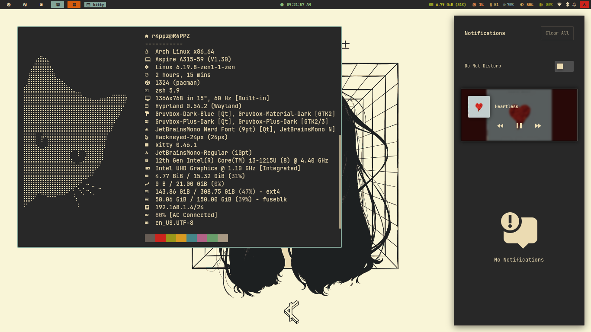
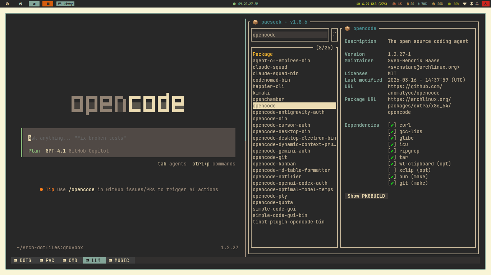
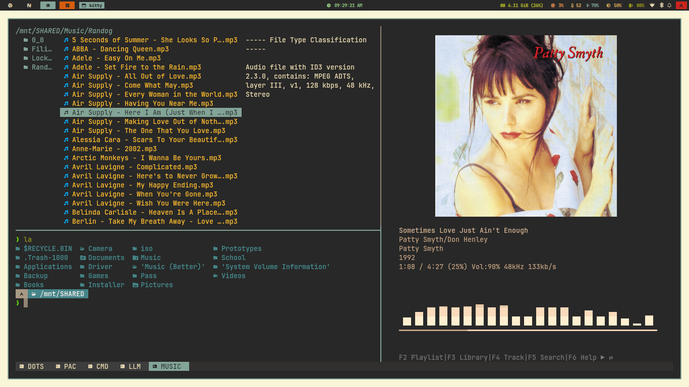
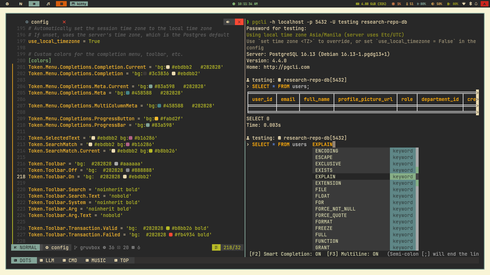
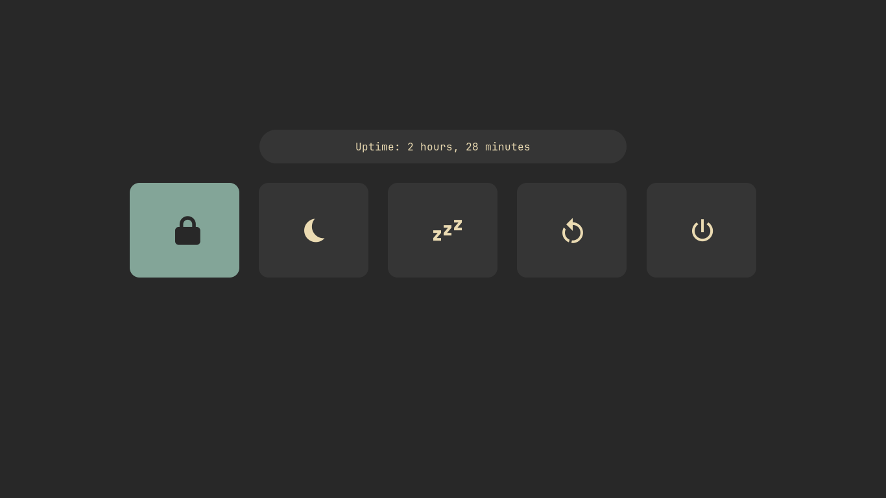
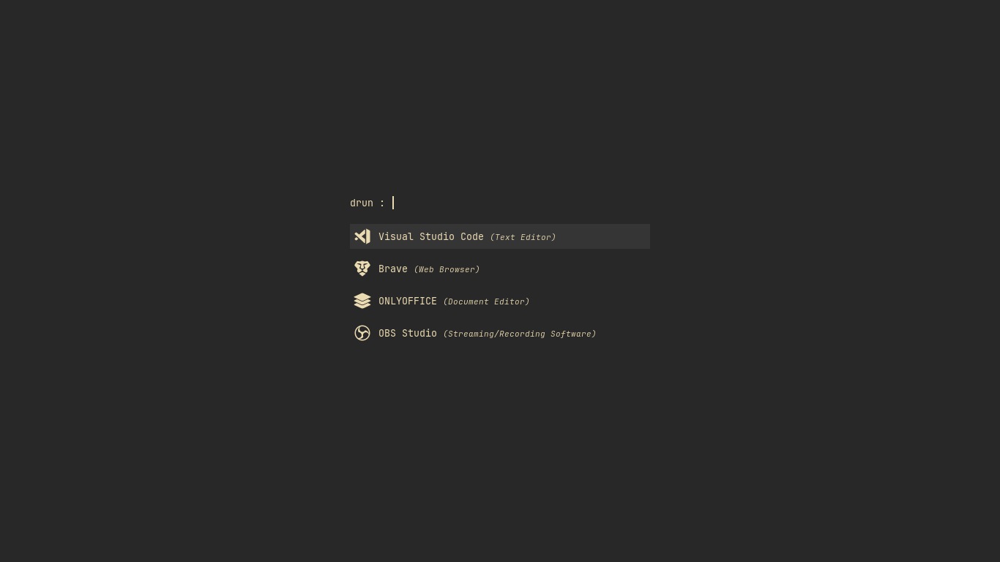
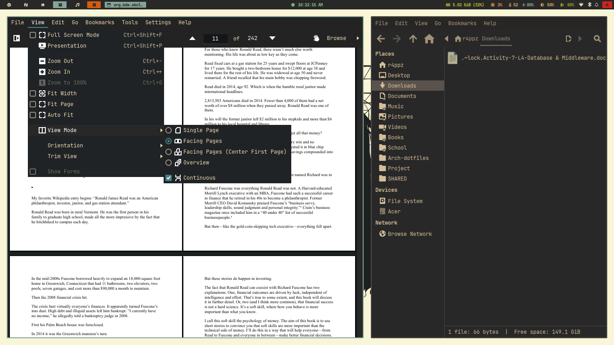
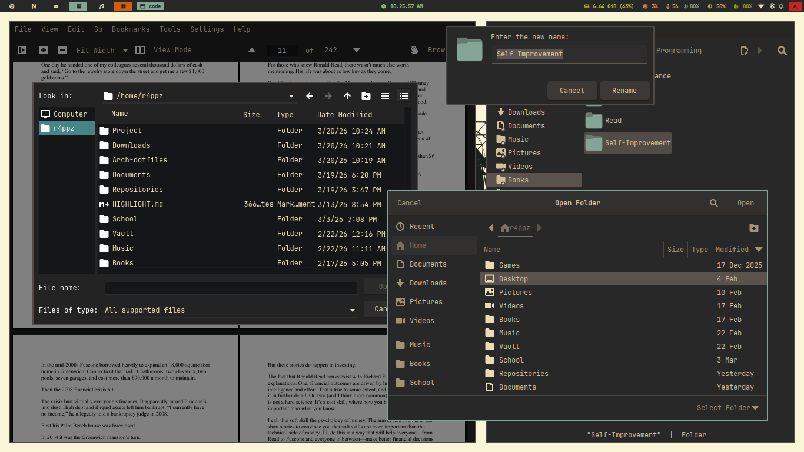

## My personal dotfiles for Arch Linux + Hyprland.

This is my setup's backup in case I mess something up and a living reference of how I've configured things.

These files fit my workflow and my taste. Look through, take ideas, build your own ;)

> I don’t have a full installation script because I hate the idea of blindly running something to replicate a setup from scratch. There is a symlink script to link some of the dotfiles, but it’s just for convenience — it won’t recreate the whole system.

### Setup

- **OS:** Arch Linux
- **WM:** [Hyprland](https://hyprland.org/)
- **Terminal:** [Kitty](https://github.com/kovidgoyal/kitty)
- **Shell:** Zsh + [Antidote](https://antidote.sh/) ([Plugins](zsh/.zsh_plugins.txt))
- **Font:** JetBrainsMono Nerd Font
- **Theme:** Gruvbox
  - GTK: [Gruvbox-Material-Dark](https://github.com/TheGreatMcPain/gruvbox-material-gtk)
  - QT: [Gruvbox-Dark-Blue](https://github.com/sachnr/gruvbox-kvantum-themes)
  - Icons: [Gruvbox Plus Dark](https://github.com/SylEleuth/gruvbox-plus-icon-pack)
- **Cursor:** [Hackeyed](https://www.gnome-look.org/p/999998)
- **Display Manager:** [SDDM](https://github.com/sddm/sddm) ([config](https://github.com/Keyitdev/sddm-astronaut-theme))
- **Notification:** [SwayNC](https://github.com/ErikReider/SwayNotificationCenter)
- **Bar:** [Waybar](https://github.com/Alexays/Waybar)
- **Launcher:** [Rofi](https://github.com/davatorium/rofi)
- **File Managers:** Thunar (GUI), [Yazi](https://yazi-rs.github.io/) (TUI)
- **Music Player:** [kew](https://github.com/ravachol/kew)
- **Editor:** [nvim](https://github.com/neovim/neovim)

> _I love the terminal ❤︎_

Screenshots with configs

[Neovim](https://github.com/r4ppz/nvZzz),
[Kitty](kitty/kitty.conf),
[Tmux](tmux/tmux.conf),
[Waybar](waybar.config.jsonc) ,
[Zsh](zsh/.zshrc),

|                                                                                                                          |                                                                                                                           |
| ------------------------------------------------------------------------------------------------------------------------ | ------------------------------------------------------------------------------------------------------------------------- |
|  [SwayNC](swaync/), [FastFetch](fastfetch) |  [OpenCode](opencode/), [Pacseek](pacseek/) |
|  [Yazi](yazi/), Kew                        |  [pgcli](pgcli/)                            |
|  Rofi ([PowerMenu](rofi/powermenu/))       |  Rofi ([App Launcher](rofi/launcher))       |
|  GTK and QT                                |  GTK and QT (pickers)                       |
