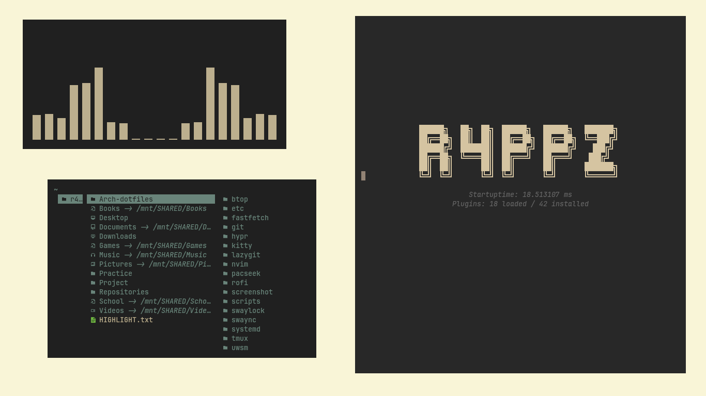
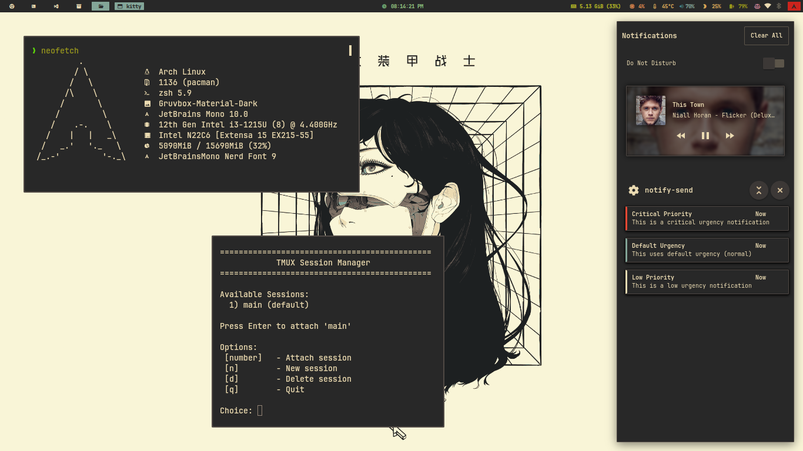
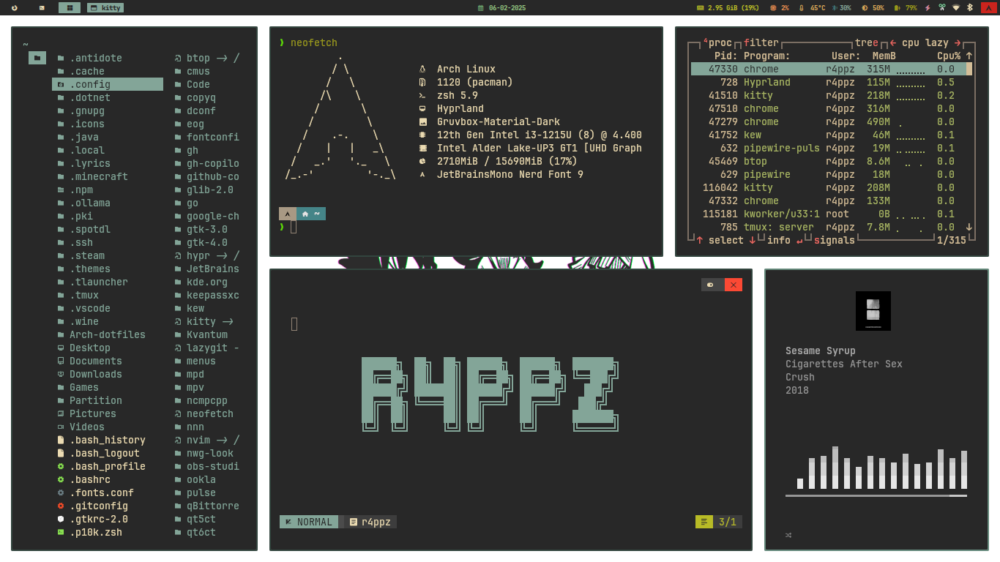
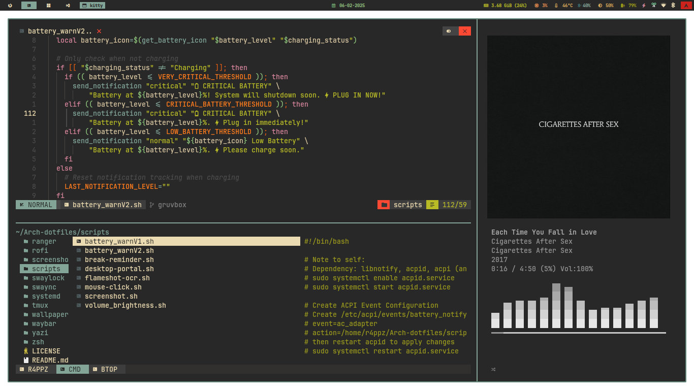
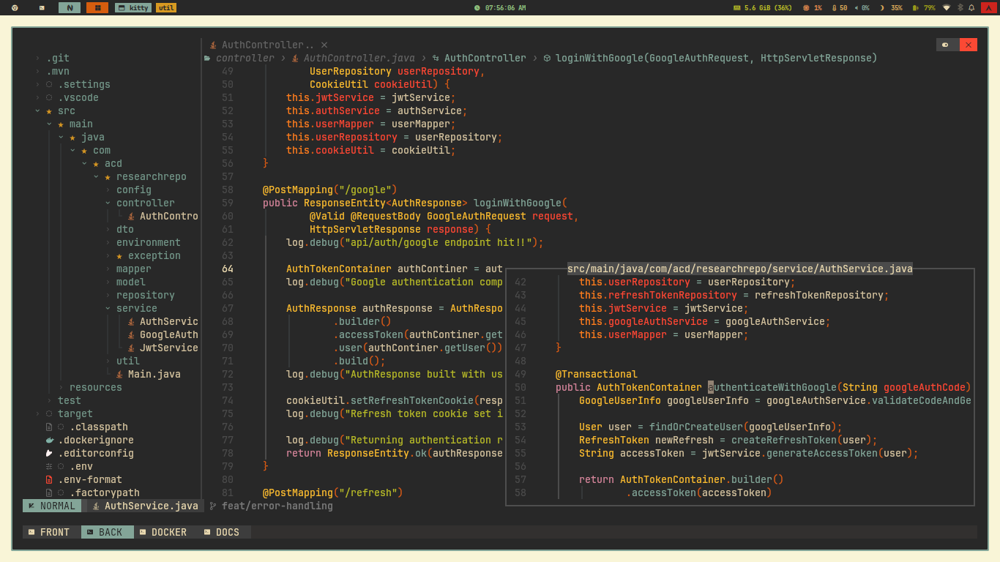
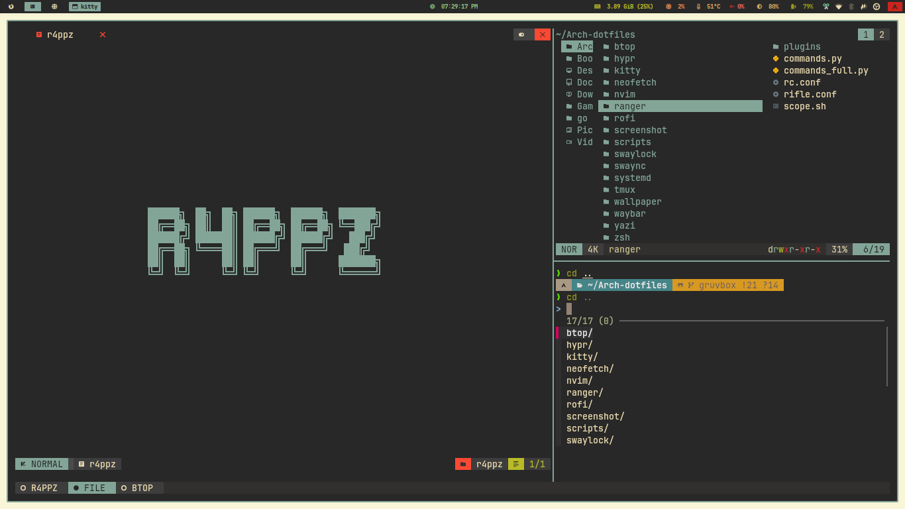
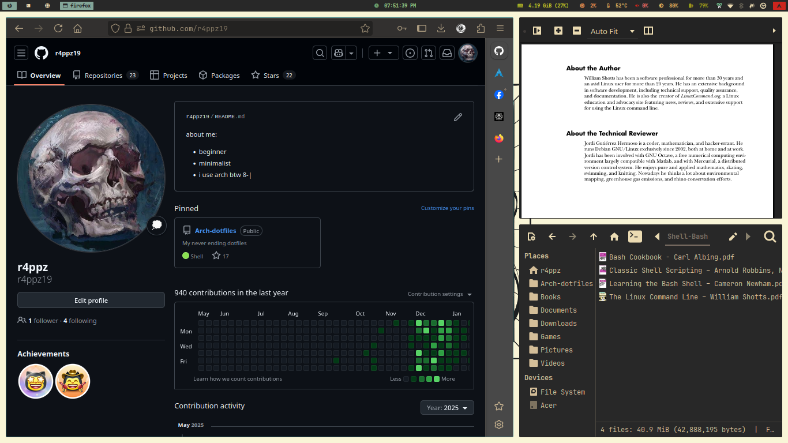
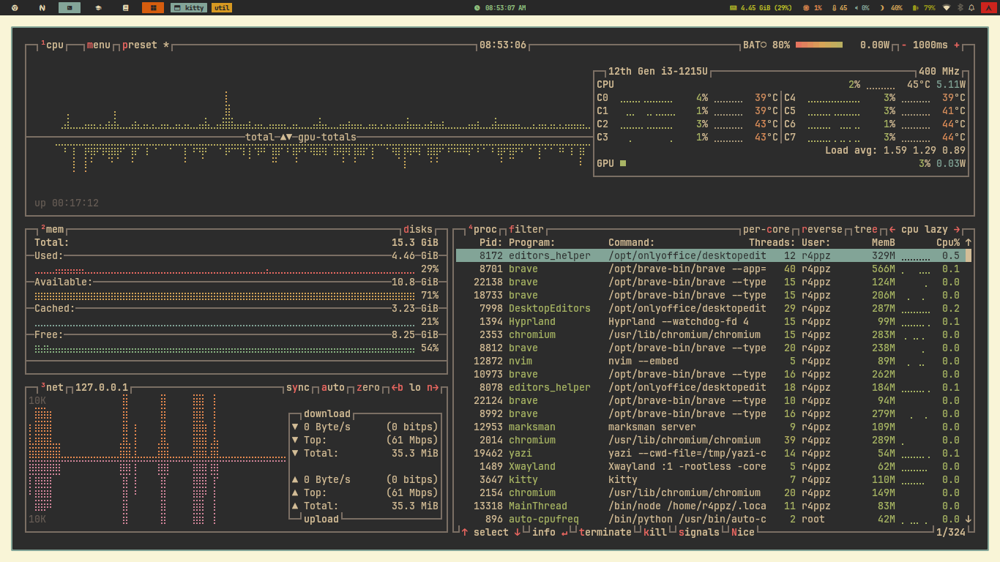
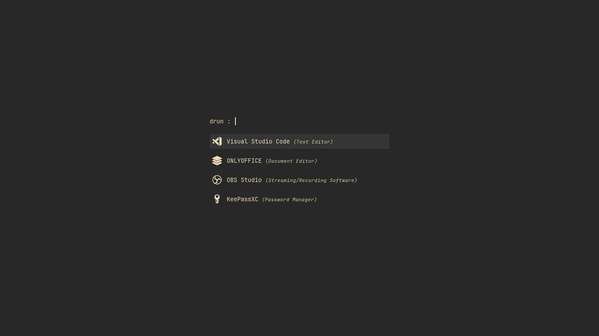
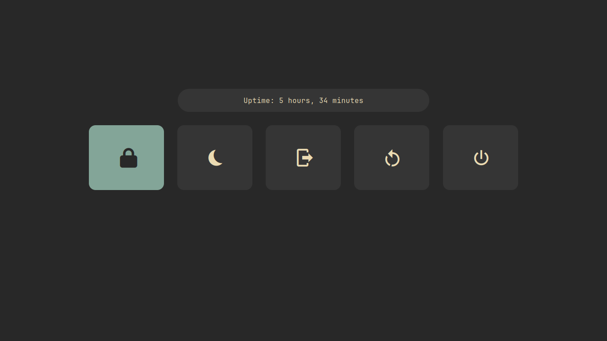

## My personal dotfiles for Arch Linux + Hyprland.

This is my setup's **backup** in case I mess something up and a living **reference** of how I've configured things.

These files fit _my_ workflow and _my_ taste. Look through, take ideas, build your own ;)

### Setup

- **OS:** Arch Linux
- **WM:** [Hyprland](https://hyprland.org/)
- **Terminal:** [Kitty](https://github.com/kovidgoyal/kitty)
- **Shell:** Zsh + [Antidote](https://antidote.sh/) ([Plugins](zsh/.zsh_plugins.txt))
- **Font:** JetBrainsMono Nerd Font
- **Theme:** Gruvbox
  - GTK: [Gruvbox-Material-Dark](https://github.com/TheGreatMcPain/gruvbox-material-gtk)
  - QT: [Gruvbox-Dark-Blue](https://github.com/sachnr/gruvbox-kvantum-themes)
  - Icons: [Gruvbox Plus Dark](https://github.com/SylEleuth/gruvbox-plus-icon-pack)
- **Cursor:** [Hackeyed](https://www.gnome-look.org/p/999998)
- **Display Manager:** [SDDM](https://github.com/sddm/sddm) ([config](https://github.com/Keyitdev/sddm-astronaut-theme))
- **Notification:** [SwayNC](https://github.com/ErikReider/SwayNotificationCenter)
- **Bar:** [Waybar](https://github.com/Alexays/Waybar)
- **Launcher:** [Rofi](https://github.com/davatorium/rofi)
- **File Managers:** Thunar (GUI), [Yazi](https://yazi-rs.github.io/) (TUI)
- **Music Player:** [kew](https://github.com/ravachol/kew)
- **Editor(IDE):** [Neovim](nvim/)

|                                                              |                                                              |
| ------------------------------------------------------------ | ------------------------------------------------------------ |
|  |  |
|  |  |
|  |  |
|  |  |
|  |  |
