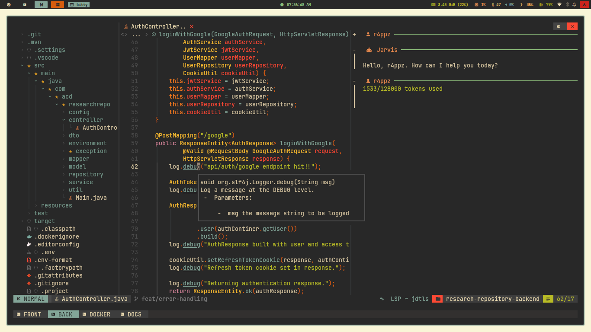
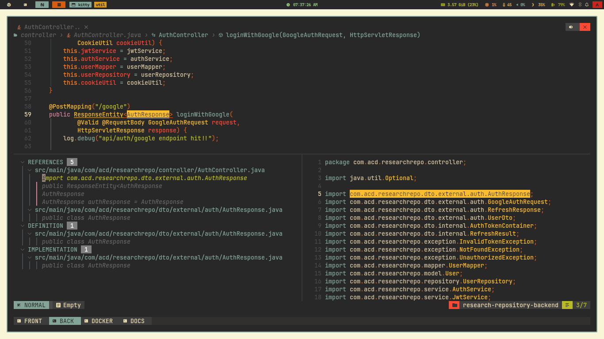

### My Personal Neovim Configuration

> **WARNING:** This config sucks. Proceed with caution.

This is my messy Neovim setup that I use for everyday coding (IDE).

## arrows > hjkl ?!

idk

[Screen record](https://github.com/user-attachments/assets/646ba986-ea84-4e03-a66c-457fb5e25caf)
